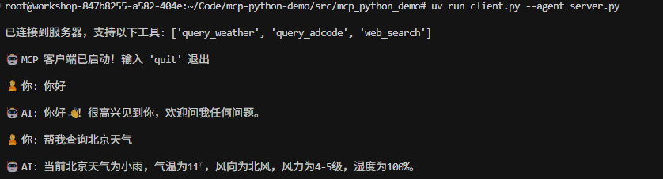

# MCP Python Demo

这是一个基于 MCP (Model Context Protocol) 的项目，集成了智谱 AI 和腾讯地图 API，提供了天气查询、地理编码和网络搜索等功能。项目包含命令行界面和 Web 界面两种交互方式。

## 功能特性

- 🤖 智谱 AI 驱动的对话系统
- 🌤️ 腾讯地图天气查询
- 🗺️ 地理编码查询
- 🔍 智能网络搜索
- 💻 命令行和 Web 界面双重支持
- 🌐 支持外网访问

## 项目结构

```
mcp-python-demo/
├── src/
│   └── mcp_python_demo/
│       ├── __init__.py
│       ├── server.py
│       ├── client.py
│       ├── web_client.py
│       └── main.py
├── images/
├── pyproject.toml
├── .env
├── .env.example
├── .gitignore
└── README.md
```

## 快速开始

### 环境要求

- Python >= 3.10
- uv (推荐) 或 pip

### 安装

1. 克隆项目：
```bash
git clone https://github.com/chenchen0611/mcp-python-demo.git
cd mcp-python-demo
```

2. 使用 uv 安装依赖：
```bash
uv venv
source .venv/bin/activate  # Linux/Mac
# 或
.venv\Scripts\activate  # Windows
uv pip install -e .
```

### 配置

1. 创建 `.env` 文件并配置必要的环境变量：
```bash
# 智谱AI配置
ZHIPU_API_KEY="your-zhipu-api-key"
ZHIPU_MODEL="glm-4-plus"
ZHIPU_BASE_URL="https://open.bigmodel.cn/api/paas/v4/"

# 腾讯地图API配置
TENCENT_MAP_API_KEY="your-tencent-map-api-key"
TENCENT_MAP_API_BASE="https://apis.map.qq.com/ws/"
```

### 运行

#### Web 界面（推荐）

```bash
cd src/mcp_python_demo
streamlit run web_client.py
```

访问以下地址之一：
- 本地访问：http://localhost:8501
- 局域网访问：http://[your-local-ip]:8501
- 外网访问：http://[your-public-ip]:8501

##### 页面配置

 - 直接输入server.py,点击连接
 
 - 新建一个terminal，运行下方命令然后在web页面输入http://127.0.0.1:8000
    ```bash
    cd src/mcp_python_demo
    uv run server.py
    ```
    

#### 命令行界面

```bash
cd src/mcp_python_demo
# 使用本地服务器
uv run client.py --agent server.py

# 或使用远程服务器
uv run server.py
uv run client.py --agent http://127.0.0.1:8000
```


## 可用工具

### 1. 天气查询
```python
async def query_weather(adcode: str, search_type: str = "now") -> str:
    """获取中国城市天气信息"""
```

### 2. 地理编码查询
```python
async def query_adcode(region_name: str) -> str:
    """获取行政区划代码"""
```

### 3. 网络搜索
```python
async def web_search(search_query: str, search_engine: str = "search_std") -> str:
    """使用智谱AI进行网络搜索"""
```

## 开发说明

### 添加新工具

1. 在 `server.py` 中使用 `@mcp.tool()` 装饰器添加新工具：
```python
@mcp.tool()
async def your_tool(param1: str, param2: str = "default") -> str:
    """工具描述"""
    # 实现逻辑
    return result
```

2. 工具会自动在客户端可用

### 环境变量

- 所有敏感信息和配置都应该放在 `.env` 文件中
- 不要将 `.env` 文件提交到版本控制系统
- 参考 `.env.example` 进行配置

## 常见问题

1. **连接错误**
   - 检查服务器地址是否正确
   - 确认所有环境变量都已正确配置
   - 确保服务器正在运行且端口可访问

2. **API 调用失败**
   - 验证 API 密钥是否有效
   - 检查网络连接
   - 确认 API 调用频率是否超限

3. **Web UI 无法访问**
   - 检查防火墙设置
   - 确认端口是否开放
   - 验证服务器 IP 地址是否正确

## 致谢

本项目基于以下开源项目：

- [Model Context Protocol Servers](https://github.com/modelcontextprotocol/servers) - MCP 官方服务器参考实现，提供了丰富的示例和最佳实践
- [MCP Python SDK](https://github.com/modelcontextprotocol/python-sdk) - Python SDK 实现，提供了简洁优雅的 API 接口


